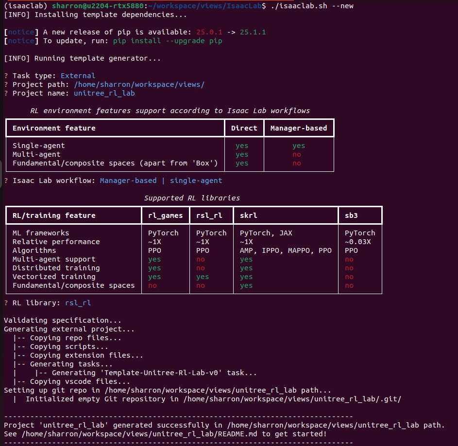

# Generate unitree_rl_lab from Isaac Lab template

This folder was generated from Isaac Lab template, as an out-of-tree external project to the Isaac Lab. Below screen snapshot illustrates the steps to generate this folder with Isaac Lab.

Minor changes were made to the subtree structure of the generated codes, "unitree_rl_lab/source/unitree_rl_lab/unitree_rl_lab/tasks/manager_based/", for better traceability of the legacy code structure.
